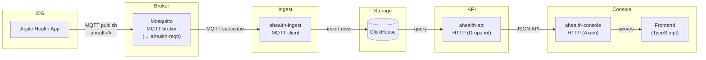

# apple-health-dash

A self-hosted Apple Health analytics platform.

## Architecture



## Projects

| Crate | Description |
|---|---|
| `ahealth-mqtt` | MQTT broker (planned replacement for Mosquitto) |
| `ahealth-ingest` | Subscribes to MQTT, writes health metrics to ClickHouse |
| `ahealth-api` | Dropshot HTTP API over ClickHouse |
| `ahealth-console` | Axum server + TypeScript dashboard frontend |

## Development

```sh
just          # list available recipes
just ingest   # run the MQTT collector
just build    # build all Rust crates
just ci       # fmt check + clippy + tests
```
